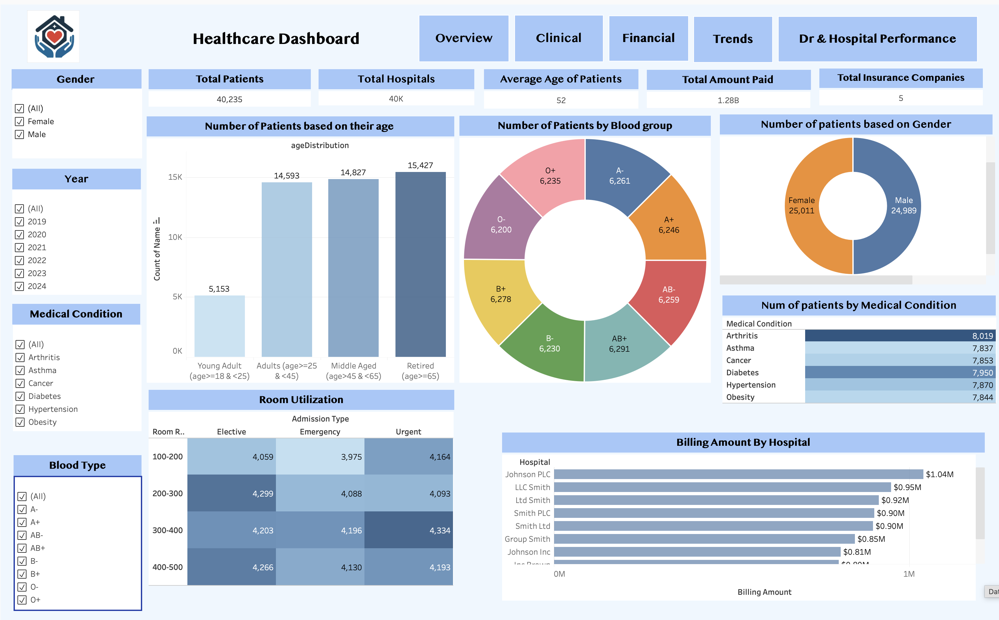
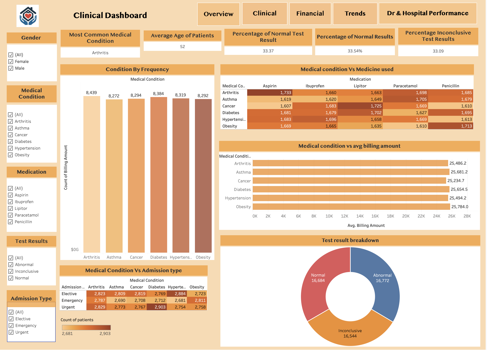
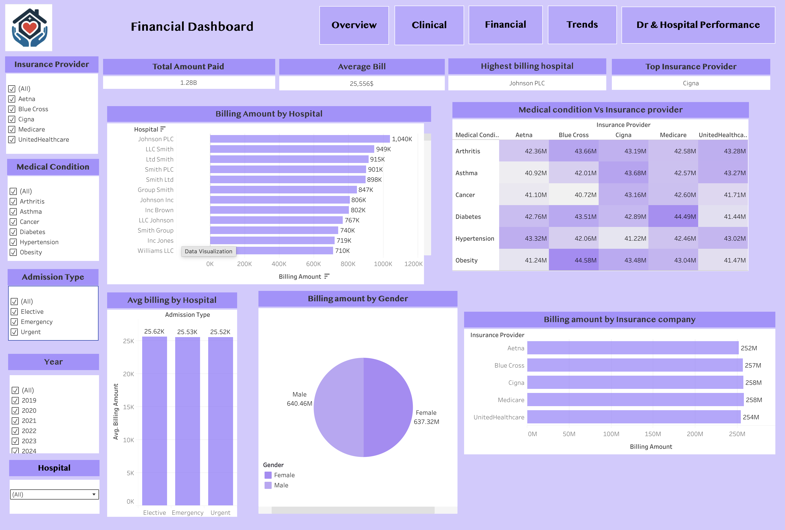
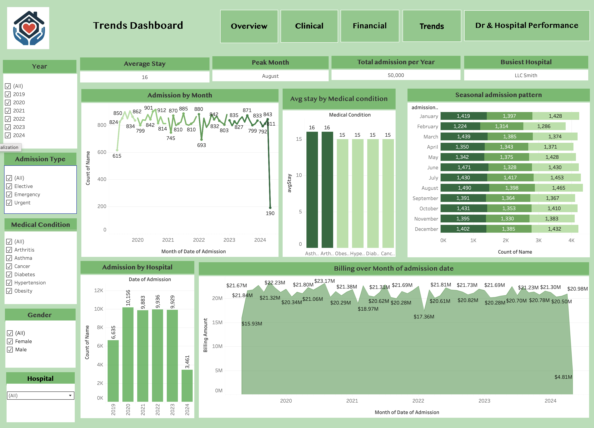
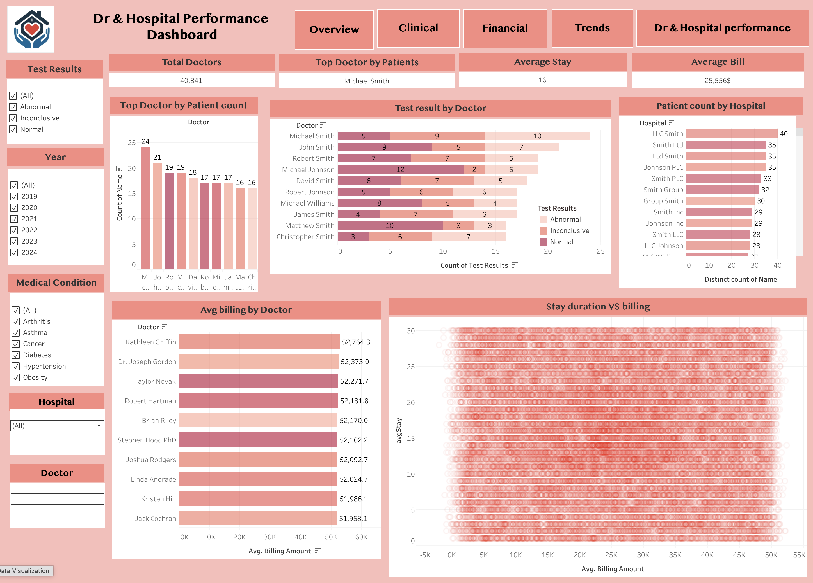

# Healthcare_Dashboard_Tableau | [Tableau](https://public.tableau.com/app/profile/bhoomi.bhatt/viz/Hospital_Dashboard_Tableau/Overview)
# 🏥 Healthcare Data Analysis | [Dataset](https://www.kaggle.com/datasets/prasad22/healthcare-dataset/code)

A comprehensive data analysis project exploring patient admissions, 
billing patterns, and medical trends using Python and Tableau.

## 📊 Dataset
Patient healthcare records containing admissions, billing, 
diagnoses, and discharge information across multiple hospitals.

## 🔍 Key Analysis
- **Patient Demographics** — Age distribution, gender split, blood type breakdown
- **Admission Patterns** — Seasonal trends, monthly admissions by year
- **Room Utilization** — Patient distribution across room ranges by admission type
- **Billing Analysis** — Average billing by medical condition, top hospitals by revenue
- **Stay Duration** — Average length of stay vs billing amount correlation
- **Medical Conditions** — Patient count and billing per condition
- **Test Results** — Doctor-wise breakdown of Abnormal/Normal/Inconclusive results

## 🛠️ Tools Used
- **Python** — Pandas, NumPy, Matplotlib
- **Tableau** — Interactive dashboards and visualizations

## 📁 Files
- `healthcare_analysis.ipynb` — Python analysis notebook
- `healthcare_dashboard.twbx` — Tableau workbook

## 💡 Key Findings
- No significant correlation between stay duration and billing amount
- Admission rates remain consistent across all months (~4K per month)
- Billing amounts are uniformly distributed across medical conditions

